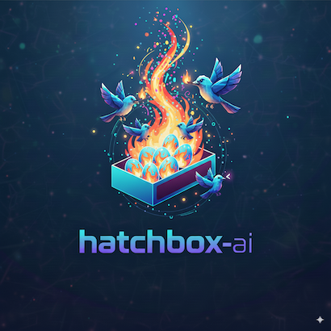

# Hatchbox AI

<div align="center">
  
</div>

> Scale understanding, not just output.

## A Very Modern Problem

The promise of AI-assisted development is profound: write more code, ship features faster, handle complexity at scale. But there's a hidden cost that most tools ignore.

**AI agents are incredibly powerful at generating code. They're remarkably poor at staying in sync with their human collaborator.**

When you're juggling multiple issues simultaneously, the real challenge isn't the mechanics of branch switching or port conflicts. It's cognitive: **keeping yourself and your AI aligned on what you're trying to accomplish**.

The friction compounds quickly:

Work on 10 GitHub issues a day, 3 at a time, and you and your AI lose track. It's stressful. Chaotic. You start new Claude chats for each problem, then have to context switch in your own head to figure out what context to provide. That mental overhead is painful. You wonder if AI-assisted coding is actually making things worse. The promise was speed and convenience. The reality feels unproductive and overwhelming.

Hidden assumptions make it worse: your AI assumes you want to use Axios when your team standardizes on fetch, or picks the wrong authentication pattern because it never learned your team's conventions. Hit the context window limit mid-conversation, and suddenly your AI shamelessly forgets the problem you were solving.

The result: more time spent briefing AI than building, more time fixing AI's work than deploying. Solutions that technically work but miss the actual intent.

**The bottleneck isn't output velocity. It's maintaining shared understanding between human and AI at scale.**

## How Hatchbox Solves This

Hatchbox takes what context you already have, and works with you to build a shared mental model of the problem you're working on.

```bash
npm -g install hatchbox-cli

hb start 25 # Pulls in issue 25 from GitHub, even if it's just an issue title. Fills in the blanks alongside you.

# or 

hb start "user auth broken" # Creates an issue, builds that same shared mental model from scratch.

# or

hb start 34 # grabs context from this PR and its original issue, then iterates on it alongside you 

# then

hb finish # it knows which hatchbox you're in, runs vaidation, and merges your code back to your primary branch. If you hit compilation/lint/test failures or merge conflicts along the way - Claude will help resolve them automaticaly.
```


Hatchbox treats context as a first-class concern. It's not a tool for managing branches - it's a control plane for maintaining alignment between you and your AI assistant as you work across multiple issues simultaneously.

**The Hatchbox difference**: Surface hidden assumptions up front, then persist all the analysis and reasoning in GitHub issue comments - visible and editable - rather than burning tokens in the context window where they're invisible and set in stone. Each hatchbox builds up structured context over multiple steps, but the AI only loads what's relevant for the current phase.

### One Command, Parallel Work, Predictable Flow

`hb start` doesn't just create a hatchbox. Here's what happens:

- Fetches the full GitHub issue (or PR) including all comments and requirements - or not, if they don't exist.
- Creates an isolated environment (Git worktree, database branch, web server on determinstic, unique port)
- Enhances the GitHub issue with better issue descriptions, structured analysis and planning. Asking questions and stating assumptions along the way, all in GitHub comments.
- Launches Claude with this context pre-loaded from the issue, guides you through a structured workflow. You can stop at any time, pick up where you left off.
- Each hatchbox is color coded - from terminal windows to VSCode, so you visually know which context you're in

**When you switch to this hatchbox, both you and Claude know exactly what you're working on and why.**

### Merge with Confidence

```bash
hb finish
# ✅ Runs tests, types, lint - Claude helps fix any failures automatically
# ✅ Generates commit message from the issue context
# ✅ Handles merge conflicts with AI assistance
# ✅ Merges to main
# ✅ Cleans up everything - worktree, database branch, and the web server you were using to test the work
```

This isn't just convenience automation. You know you're merging the correct code, correctly - the commit message is auto-generated from the structured issue context, and any build/test/merge failures get fixed automatically with Claude's help. It helps keep resources in check too - local and remote by safely shutting down servers and cleaning up Neon db branches.

## What This Means for How You Work

### You Stop Babysitting Your AI, Start Collaborating With It

Traditional approach:
1. Start working on a feature
2. Explain context to Claude
3. Review Claude's generated code, discover mistakes and misunderstanding
4. Get asked to fix an urgent bug - stash or WIP commit, switch branch, spin up new Claude
5. Lose context on your progress, face all the same issues with your urgent bug fix

Hatchbox approach:
1. `hb start 45` - feature work in progress
2. Review Hatchbox's analysis in Github, correct an assumption, move to the planning phase
2. `hb start 99` - urgent bug, Claude already has the context from the issue
3. You can switch between them as they work - color coding makes it easy to tell each hatchbox apart.
3. `hb finish` - urgent bug fixed and merged
4. Switch back to the feature hatchbox - you and Claude pick up exactly where you left off - you can simply re-read the issue's comments to get on the same page as Claude.
5. `hb finish` - Issue #45 is in the bag too.

**The difference**: Your AI becomes a persistent collaborator rather than a tool you're constantly playing catch-up with.

**Plus, your AI's reasoning is now visible to everyone, including future you:**
The AI analysis gets posted as GitHub comments, so anyone on your team can see the context and planning without having to ask you for background.

### You Scale Understanding, Not Just Output

Without Hatchbox, adding AI to your workflow increases code production but also increases cognitive load. You're managing what the AI knows, correcting misaligned suggestions, and second-guessing its understanding. Not to mention managing its context window.

With Hatchbox, the cognitive load stays constant as you scale. Each hatchbox is a bounded context where you and your AI share complete understanding. Work on ten issues simultaneously, and each one maintains perfect clarity about its own purpose.

**This is how you achieve sustainable velocity with AI assistance.**

### You Reduce Rework and Chaos

When you and your AI are in lock step:
- Features get built right the first time because you spot when the AI is going off course, way before it writes a line of code.
- Reviews focus on the quality of the AI's thinking, not just its code.
- Fewer suprises thanks to AI agents invetning requirements or inconsistently implementing existing patterns
- If the AI takes a wrong turn - you don't spend hours arguing with Claude and playing context window Tetris. You just start the process again with better issue descriptions, different assumptions and better context for your AI assistant.

### The Power of Predictable Flow

Every Hatchbox follows the same rhythm — Start → Enhance → Analyze → Plan → Implement → Human Review → Finish.  
The steps never change. The tools stay aligned.  
Predictability becomes muscle memory — you focus on ideas, not process.

## How It Works

Hatchbox orchestrates specialized AI agents that analyze issues, evaluate complexity, create implementation plans, and document everything directly in GitHub comments. Each agent has a specific role and writes structured output that becomes permanent project, and team, knowledge.

### Creating Context

```bash
hb start 25
```

Hatchbox executes a multi-phase context-establishment workflow:

1. **Fetch complete requirements** - GitHub issue body + all comments
2. **Create isolated hatchbox** - Git worktree at `~/project-hatchboxes/issue-25-auth-issues/` (branch names are generated)
3. **Run AI workflow agents** - Enhance, analyze, plan, and document directly in GitHub comments:
   - **Enhancement Agent**: Expands brief issues into detailed requirements (if needed)
   - **Complexity Evaluator**: Assesses scope and determines workflow approach
     - **Simple workflow**: Combined analysis and planning in one step
     - **Complex workflow**: Separate analysis phase, then detailed planning phase
4. **Establish environment** - Unique web server port (i.e. 3025), isolated database branch, `.env` file with correct DATABASE_URL env var
5. **Launch tools** - VSCode with color theme, dev server, Claude with pre-loaded context from GitHub comments

**Result**: A complete bounded context where both you and your AI share understanding, with all context stored as structured GitHub comments. Open the issue in your browser to see:
- Enhancement analysis (if the issue was brief)
- Complexity evaluation with metrics
- Root cause analysis and technical findings
- Implementation plan (for complex issues)
- All context is editable, reviewable, and persists across machines

### Maintaining Context

Each hatchbox is isolated:

- **Git worktree** - Separate filesystem, different branch checked out, no switching overhead
- **Database branch** - Schema changes don't affect other contexts (optional, requires Neon - other provider support coming soon)
- **Unique port** - Multiple dev servers run simultaneously (base port + issue number)
- **Environment variables** - Each hatchbox has correct database URL
- **Visual identity** - Color-coded VSCode window (40 distinct pastel colors)
- **GitHub issue comments** - Multi-phase context (enhancement, analysis, planning) persists and is editable by team members

**When you switch hatchboxes, the context switches with you.**

### Context That Scales With Your Team

Traditional AI workflows store context locally in chat history or markdown files. Hatchbox stores context where it belongs - in the GitHub issue itself.

**Benefits:**

- **Transparency**: All AI analysis and planning is visible to your entire team
- **Collaboration**: Team members can review, comment on, and refine AI-generated context
- **Persistence**: Context survives repository clones, machine switches, and team member changes
- **Version Control**: GitHub tracks all context changes with timestamps and authors
- **Searchability**: GitHub's search finds AI insights across all your issues
- **Integration**: Context appears in notifications, project boards, and automation workflows
- **No Sync Issues**: Everyone sees the same context - no local file drift

When Claude analyzes your issue and creates a comment with "### Root Cause Analysis", that insight becomes permanent project knowledge. When you switch machines, clone the repo elsewhere, or bring in a new team member - the context is already there.

**This is context as infrastructure, not files.**

### Understanding the Multi-Agent Workflow

When you run `hb start 25`, Hatchbox orchestrates specialized AI agents that work through a structured analysis and planning process:

**Phase 1: Enhancement (optional)**
- Checks if issue needs more detail (word count, structure, clarity)
- Expands brief descriptions into comprehensive requirements
- Posts enhancement as a GitHub comment

**Phase 2: Complexity Evaluation**
- Analyzes scope, file changes, breaking changes, risks
- Classifies as SIMPLE or COMPLEX
- Posts evaluation as a GitHub comment with metrics

**Phase 3: Analysis**
- Investigates root causes and technical constraints
- Documents findings and implementation considerations
- Posts analysis as a GitHub comment

**Phase 4: Planning** (COMPLEX issues only)
- Creates detailed implementation roadmap
- Breaks work into phases with validation points
- Posts plan as a GitHub comment

**Phase 5: Implementation Tracking**
- Updates progress in a GitHub comment
- Documents decisions and completion status

All agent output is written to GitHub issue comments using a structured markdown format, making the AI's reasoning process transparent and collaborative. You can review, edit, or refine any comment before proceeding to the next phase.

## Commands

### Hatchbox Management

```bash
hb start <issue-number | pr-number | issue-description | branch-name>
# Create hatchbox with complete context
# Orchestrates AI agents that analyze the issue and post structured comments
# Phases: Enhancement → Analysis → Planning → Implementation with review checkpoints at every step
# Aliases: create, up
# Options:
#   --one-shot <mode>  - Automation level for Claude CLI
#                        default: Standard behavior with prompts
#                        noReview: Skip template approval prompts
#                        bypassPermissions: Full automation, skip all prompts. Be careful!

hb finish
# AI assisted validation, commit, merge steps, as well as hatchbox cleanup (run this from hatchbox directory)
# Alias: dn

hb cleanup [identifier...]
# Remove a hatchbox without merging (safely, by default)

hb list
# Show active hatchboxes with their ports and paths

hb ignite
# Launch Claude with auto-detected hatchbox context
# Options:
#   --one-shot=<mode>  - Same automation modes as 'start'

hb open [identifier]
# Open hatchbox in browser (web projects) or run configured CLI tool
```

### Issue Management

```bash
hb add-issue <description>
# Create and AI-enhance GitHub issue (doesn't start hatchbox)
# Alias: a
# Example: hb add-issue "Add dark mode toggle to settings"

hb enhance <issue-number>
# Apply AI enhancement agent to existing GitHub issue
# Expands requirements and adds implementation context
```

### Setup

```bash
hb init
# Setup guide for shell autocomplete (will do much more soon)
# Run once per project
```

## Configuration

Hatchbox uses `.hatchbox/settings.json` for project-specific behavior:

**Key Configuration:**

```json
{
  "mainBranch": "main",
  "capabilities": {
    "web": { "basePort": 3000 }
  },
  "workflows": {
    "issue": {
      "permissionMode": "default",
      "startIde": true,
      "startDevServer": true,
      "startAiAgent": true
    }
  },
  "agents": {
    "issueEnhancer": "sonnet",
    "branchNamer": "haiku"
  }
}
```

**Configuration options:**
- `mainBranch` - Primary branch for merging (default: "main")
- `capabilities.web.basePort` - Base port for dev servers (default: 3000)
- `workflows` - Per-workflow Claude CLI permission modes and tool launching
- `agents` - Claude model selection (sonnet/opus/haiku) per agent type

Port calculation: `assignedPort = basePort + issueNumber`
Example: Issue #25 with basePort 3000 = port 3025

For complete configuration reference, see [.hatchbox/README.md](./.hatchbox/README.md)

## Requirements

**Essential:**
- Claude CLI - AI assistance with issue context pre-loaded
- Node.js 16+
- Git 2.5+ (for worktree support)
- GitHub CLI (`gh`) - authenticated with your repository

**Recommended**
- A Claude Max subscription

**Optional (auto-detected):**
- **Neon CLI** - Isolated database branches per hatchbox 
- **VSCode** - Color-coded editor windows for visual context

The tool works with just the essentials. Optional features activate automatically when detected.

## Installation

```bash
# Install globally
npm install -g hatchbox-cli

# Authenticate with GitHub
gh auth login
# do gh auth login --scopes project to automatically move issues to in progress 

# Initialize in your project
cd your-project

# Start working
hb start 25 # existing issue
hb start "Enable log in/sign up with Google account" # new issue
```

## Pull Request Support

Hatchbox works identically with GitHub pull requests:

```bash
hb start 125  # PR number instead of issue number
```

Automatically detects PR, fetches the branch, and creates hatchbox with PR context. Everything else works the same.

## Development Status

**Currently in Development** - Converting proven bash workflow scripts to robust TypeScript implementation.

This migration brings:
- **Type safety** and better error handling
- **Test-driven development** (70% coverage requirement)
- **Cross-platform compatibility**
- **Enhanced Claude AI integration**

The bash scripts work and are being used daily. The TypeScript version is replacing them with a more maintainable foundation.

See [plan.md](./plan.md) for complete development roadmap and [docs/](./docs/) for technical documentation.

## Architecture

**Technologies:**
- TypeScript CLI built with Commander.js
- Git worktrees for hatchbox isolation
- GitHub CLI integration for issues/PRs
- Integration with node-based web servers via standard package.json scripts
- Database branching (Neon) - optional
- Claude CLI integration for AI assistance to resolve compilation/test/lint/merge errors.

**Project structure:**
```
src/
├── commands/          # CLI commands (start, finish, cleanup, list, add-issue, enhance, ignite, init, open)
├── lib/              # Core business logic (WorkspaceManager, GitWorktreeManager, etc.)
├── utils/            # Utility functions (git, github, env, database, shell)
└── types/            # TypeScript definitions
```

For development guidelines and testing strategy, see [CLAUDE.md](./CLAUDE.md).

### Understanding Git Worktrees

A Git worktree is a separate working directory for the same repository. Instead of switching branches in one directory, you have multiple directories with different branches checked out simultaneously.

Traditional approach:
```bash
git checkout feature-a    # Switch branch
# Edit files
git stash                 # Save work
git checkout feature-b    # Switch branch again
# Edit different files
git stash pop             # Restore work
git checkout feature-a    # Switch back
```

Worktree approach:
```bash
# All exist simultaneously:
~/project-hatchboxes/issue-25/  # feature-a checked out
~/project-hatchboxes/issue-30/  # feature-b checked out
~/project/                      # main branch

# No branch switching, no stashing, less confusion
```

This is the foundation that enables hatchbox isolation and persistent context. Other awesome tools use worktrees too.

## Contributing

This project follows Test-Driven Development. All code must:
- Be written test-first with comprehensive unit tests
- Achieve >70% code coverage
- Include regression tests against bash script behavior
- Use mock factories for all external dependencies

## License

**Business Source License 1.1** - Free to use for any purpose, including commercial use within your organization.

**You can:**
- ✅ Use freely in your organization and commercial projects
- ✅ Modify and distribute internally
- ✅ Build paid applications with it

**You cannot:**
- ❌ Resell Hatchbox itself as a product or service
- ❌ Incorporate into products/services you sell to others
- ❌ Offer as a hosted service or SaaS

**Converts to Apache 2.0 on 2029-01-01** - Becomes fully open source automatically.

For commercial licensing inquiries, contact Adam Creeger.

See [LICENSE](./LICENSE) for complete terms.
